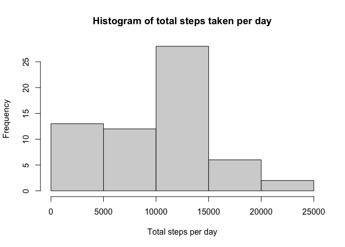
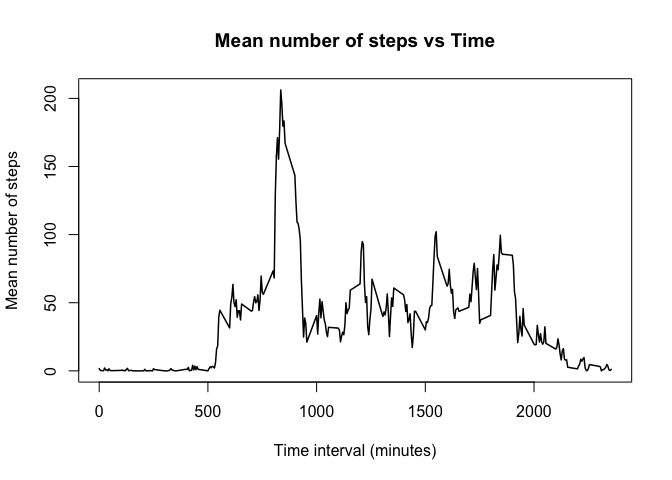
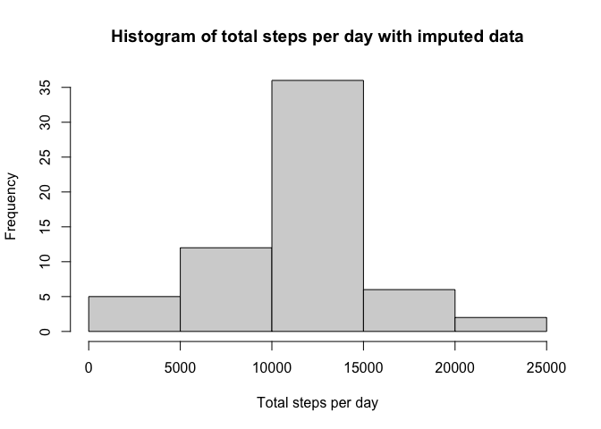
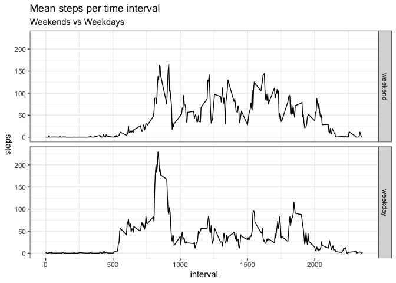

Loading and preprocessing the data
----------------------------------

I loaded the data then transformed the date variable from character to
date class

    library(stats)
    activity <- read.csv("activity.csv", header = T)
    activity$date <- strptime(activity$date, "%Y-%m-%d")
    summary(activity)

    ##      steps             date                        interval     
    ##  Min.   :  0.00   Min.   :2012-10-01 00:00:00   Min.   :   0.0  
    ##  1st Qu.:  0.00   1st Qu.:2012-10-16 00:00:00   1st Qu.: 588.8  
    ##  Median :  0.00   Median :2012-10-31 00:00:00   Median :1177.5  
    ##  Mean   : 37.38   Mean   :2012-10-31 00:25:34   Mean   :1177.5  
    ##  3rd Qu.: 12.00   3rd Qu.:2012-11-15 00:00:00   3rd Qu.:1766.2  
    ##  Max.   :806.00   Max.   :2012-11-30 00:00:00   Max.   :2355.0  
    ##  NA's   :2304

What is mean total number of steps taken per day?
-------------------------------------------------

Using the lubridate and dplyr packages, I first summed the steps per
day, then created a histogram of the total steps per day. I then found
the mean number of steps taken per day and the median number of steps
taken per day.

    library(lubridate)

    ## 
    ## Attaching package: 'lubridate'

    ## The following objects are masked from 'package:base':
    ## 
    ##     date, intersect, setdiff, union

    library(dplyr)

    ## 
    ## Attaching package: 'dplyr'

    ## The following objects are masked from 'package:stats':
    ## 
    ##     filter, lag

    ## The following objects are masked from 'package:base':
    ## 
    ##     intersect, setdiff, setequal, union

    #Sum the total steps per day
    total_steps_per_day <- activity %>% group_by(day = floor_date(date, "day")) %>% summarize(steps = sum(steps, na.rm = T))

    ## `summarise()` ungrouping output (override with `.groups` argument)

    #Create a histogram of total steps per day
    hist(total_steps_per_day$steps, xlab = "Total steps per day", main = "Histogram of total steps taken per day")

    #Find the mean and median
    mean(total_steps_per_day$steps)

    ## [1] 9354.23

    median(total_steps_per_day$steps)

    ## [1] 10395

The mean was 9,354.23 steps per day whereas the median was higher at
10,395 steps per day.

What is the average daily activity pattern?
-------------------------------------------

After looking at each individual day, I then examined the steps per 5
minute time interval. I calculated the average number of steps for each
interval across all days, created a time-series plot showing the
activity at each interval, then located the interval with the greatest
average activity level. Interval 835 with an average of 206 steps had
the greatest average number of steps.

    library(dplyr)

    #Find the mean steps per time interval
    mean_steps_per_interval <- activity %>% group_by(interval) %>% summarize(steps = mean(steps, na.rm = T))

    ## `summarise()` ungrouping output (override with `.groups` argument)

    #Create a time series plot of average steps vs time
    plot(steps~interval, data = mean_steps_per_interval, type = "l", xlab = "Time interval (minutes)", ylab = "Mean number of steps", main = "Mean number of steps vs Time", lwd = 1.5)

    #Locate the time interval with the highest mean steps
    which.max(mean_steps_per_interval$steps)

    ## [1] 104

    mean_steps_per_interval[104,]

    ## # A tibble: 1 x 2
    ##   interval steps
    ##      <int> <dbl>
    ## 1      835  206.

Interval 835 with an average of 206 steps had the greatest average
number of steps.

Imputing missing values
-----------------------

Given the number of missing values, there’s a chance there may be some
bias in the calculations due to missing values. I filled in the missing
values with the average steps per time interval, then re-ran the
analysis for daily steps, mean steps per day, and median steps per day.

    library(dplyr)
    library(lubridate)
    library(zoo)

    ## 
    ## Attaching package: 'zoo'

    ## The following objects are masked from 'package:base':
    ## 
    ##     as.Date, as.Date.numeric

    #Find the number of NAs in the data
    sum(is.na(activity$steps))

    ## [1] 2304

    #Clone the dataset, fill in the missing values in the new data frame, and check to ensure all the NA have been replaced
    activity_filled <- activity
    activity_filled$steps <- ave(activity_filled$steps, activity_filled$interval, FUN = na.aggregate)
    sum(is.na(activity_filled$steps))

    ## [1] 0

    #Create a histogram of the filled-in data
    total_steps_per_day_imputed <- activity_filled %>% group_by(day = floor_date(date, "day")) %>% summarize(steps = sum(steps, na.rm = T))

    ## `summarise()` ungrouping output (override with `.groups` argument)

    hist(total_steps_per_day_imputed$steps, xlab = "Total steps per day", main = "Histogram of total steps per day with imputed data")

    #Find the mean and median of the imputed data set
    mean(total_steps_per_day_imputed$steps, na.rm = T)

    ## [1] 10766.19

    median(total_steps_per_day_imputed$steps, na.rm = T)

    ## [1] 10766.19

Imputing data into the data frame increased the mean from 9,354.23 to
10,766.16 and the median from 10,395 to 10,766.19. The overall effect
was to normalize the total steps per day data, correcting the skew in
the original data.

Are there differences in activity patterns between weekdays and weekends?
-------------------------------------------------------------------------

I then examined whether there were differences in activity patterns
between weekdays and weekends using the filled-in data set. I started by
first splitting the dataset into weekdays and weekends before plotting
the average steps per time interval.

    library(dplyr)
    library(ggplot2)

    #Create new variable to pull weekday names and then subset the dataset based on weekday or weekend
    activity_filled$weekday <- weekdays(activity_filled$date, abbreviate = FALSE)
    weekday.1 <- c("Monday", "Tuesday", "Wednesday", "Thursday", "Friday")
    activity_filled$week <- factor((activity_filled$weekday %in% weekday.1), 
                                   levels = c(FALSE, TRUE), labels = c("weekend", "weekday"))

    #Calculate mean steps per time interval for weekdays and weekends
    mean_steps_interval_weekdays <- activity_filled %>% group_by(week, interval) %>% summarize(steps = mean(steps))

    ## `summarise()` regrouping output by 'week' (override with `.groups` argument)

    mean_steps_interval_weekdays %>% group_by(week) %>% summarize(steps = mean(steps))

    ## `summarise()` ungrouping output (override with `.groups` argument)

    ## # A tibble: 2 x 2
    ##   week    steps
    ##   <fct>   <dbl>
    ## 1 weekend  42.4
    ## 2 weekday  35.6

    mean_steps_interval_weekdays %>% group_by(week) %>% summarize(steps = median(steps))

    ## `summarise()` ungrouping output (override with `.groups` argument)

    ## # A tibble: 2 x 2
    ##   week    steps
    ##   <fct>   <dbl>
    ## 1 weekend  32.3
    ## 2 weekday  25.8

    mean_steps_interval_weekdays %>% group_by(week) %>% summarize(steps = max(steps))

    ## `summarise()` ungrouping output (override with `.groups` argument)

    ## # A tibble: 2 x 2
    ##   week    steps
    ##   <fct>   <dbl>
    ## 1 weekend  167.
    ## 2 weekday  230.

    #Plot mean steps per time interval split by weekday vs weekend
    ggplot(data = mean_steps_interval_weekdays, aes(x = interval, y = steps)) +
            geom_line() +
            theme_bw() +
            facet_grid(week~.) +
            labs(title = "Mean steps per time interval",
                 subtitle = "Weekends vs Weekdays",
                 xlab = "Time (minutes)",
                 ylab = "Mean steps per interval")

Although the weekday maximum is higher (230 steps vs 167), the weekend
had the higher average number of steps (42.4 vs 35.6) and higher median
(32.3 vs 25.8). While at first glance at the time series plot appears to
show that weekdays had more activity, it’s actually the weekends that
showed the higher activity levels, thereby demonstrating that looks can
be deceiving, even in data analysis.
